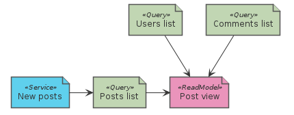
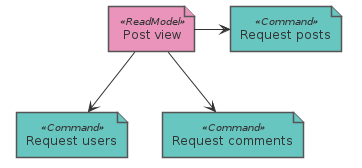
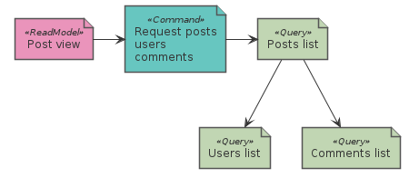
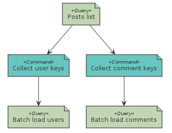

# Graph Loader

When we need to return data for the UI the single aggregate (or list) returned by our *domain service* is most of the times not enough:



In the example we suppose to display a list of posts, the view needs also informations about users and comments. One possibile commands sequence is:



This has several problems, notably over and under fetching, so we learn to use DTOs:



We have now shifted the problem on the backend, with other types of problems, notably the N+1 problem:
we load the list of posts then for each post load its users and so on.

One possibile solution are *batched loads*:



Organize an API of DTOs types with loaders and assemblers from scratch is repetitive and error-prone.

`java-dataloader` is able to load a graph layer after layer together with graphql-java
with handling of multi-threading and async loads. Unfortunately there is no easy way
to use only `java-dataloader` to achieve this task, AFAIK you have to implement the whole GraphQL stack.

Graph Loader is a tiny library for this task in a fashion similar to GraphQL + data loaders but without the GraphQL language.
It uses batch loaders to optimize the load of graph/tree structures.
Your query are static and basically consist in a set of assemblers.

## Introduction

Graph Loader is a tiny library to load a graph of objects,
for instance one or more DTOs, from a remote/slow medium that hence should be loaded in a batch for acceptable performances.

The idea comes from use cases that, in the context of a business application, are many times resolved by using data loaders and GraphQL, however you need to implement the whole GraphQL stack in order to use batched data loaders, in java you need to implement `graphql-java` to use `java-dataloader`.

If you don't need/want dinamic queries execution GL could be for you.

By the way: `graphql-java` and `java-dataloader` are great projects and have their own fields of use where `graph-loader` is almost useless. I compared GL with these projects just because the idea of *batched loads* is not new and the GraphQL paradigm is well known.

### Source code snippet

In `test` there are complete examples, also implemented and compared (using jmh) with `graphql-java`.

#### Configuration

First we define our DTOs types (plain data bags), for instance:

```java
public class PostResource {
    public String text = null;
    public UserResource author = null;
```

these would be `type` declarations in GraphQL.  
Than we need repositories capable of batch loads:

```java
public class PostRepository {
    public static Map<Long, Post> load(Set<Long> keys) {
```

these are almost the same we would need with GraphQL.  
We don't have queries, we have a list of *predefined queries* in the form of assemblers. Assemblers map values loaded from a repository to a DTO:

```java
public class PostResourceAssembler implements GlAssembler<Post, PostResource> {
    @Override
    public PostResource assemble(Post post, GlAssemblerContext context) {
        PostResource resource = new PostResource();
        resource.text = post.content;   // Simple field.
        // Get authorLoader from context.
        authorLoader.load(post.authorId, user -> resource.author = authorAssembler.assemble(user, context));   // Resource field.
```

Fields of primitive types or the ones do not require a load, are simply set on the result DTO. The key point is how fields, like `PostResource.author`, that require a load gets resolved. Here `java-dataloader` would use a `CompletableFuture`, we use a consumer of `User`, most of the time this consists just in
passing the value to the assembler and set the returned value into the result.

#### Execution


A GraphLoader instance has resolve() and resolveValue() methods:

```java
GlResult<PostResource> result = graphLoader.resolve(1L, "postLoader", new PostResourceAssembler());
Post post = ...
GlResult<PostResource> result = graphLoader.resolveValue(post, new PostResourceAssembler());
```

The `resolve()` method takes a key of generic type `K` and `resolveMany()` takes a list of `K`. Both need also a name of loader to load that keys into values of generic type `V` and an assembler to assemble `V` into our final generic type `D`.

`resolveValue()` take a value `V` and `resolveValues()` takes a list of values `V`, and execute just the second part of the process assembling them into instance of final type `D`.

From `GlResult` we can get the result, a `PostResource` in this case, or an exception if one were raised somewhere in the `resolveX()` method.

#### Async Execution

From version `1.0.3` there is also an async version of `AsyncGraphLoader`, (see tests):

```java
CompletableFeature<GlResult<PostResource>> result = graphLoader.resolve(1L, "postLoader", new PostResourceAssembler());
Post post = ...
CompletableFeature<GlResult<PostResource>> result = graphLoader.resolveValue(post, new PostResourceAssembler());
```

Use `GraphLoaderFactory` to get instances of `AsyncGraphLoader` that has the *resolve* methods
that return `CompletableFuture<GlResult<>>`. With this version of GL one can register and use
the async version of `DataLoader` that has the `dispatch()` method return a `CompletionStage`.

### How to use

```groovy
repositories {
    maven { url 'https://jitpack.io' }
}
dependencies {
    implementation 'com.github.mar9000:graph-loader:1.0.2'
}
```

### Concepts

1. *load* and *assemble*: the result gets calculated by successive approximations indeed objects resolved by GL
should be mutable. I like to use immutable objects whenever possible,
but here mutable objects seemed good enough as I plan to use GL just to prepare data
just before the serialization to JSON or XML. GraphQL for example return a mix of maps and lists
as result, here you can use the same paradigm or develop and compose your own
DTOs types.

1. *batched load*: should be possible to batch data loading, for instance load several database records or ReST
resources at once.

The main idea is:

  * a factory that last for the entire lifespan of the application,
configured with a registry a pure function (batch loaders) and a global context.
  * given an execution context it returns a graph loader that can be used to resolve
  one or more graph. Caching of data can be activated to reuse resources loaded by preceding
  executions.

### Classes

One can start designing the API from the types GL will assemble, this is how your response
data will look like. In `test` the examples use `PostResource`, `UserResource`, etc.

At the other side of the algorithm there are the objects loaded from you medium.
These can be records loaded from the database of other resources loaded via ReST.
In `test` they are `Post`, `User`, etc., let's call them *entities*.

Then one have to describe how these entities are loaded in batch. This is specified
with a set of `MappedBatchLoader` each one taking a set of keys and returning
a `Map<Key,Entity>`. `MappedBatchLoader`s are organized into a `MappedBatchLoaderRegistry`.

These `MappedBatchLoader` are wrapped transparently served as `DataLoader` that you use into an assembler
when you need to load a child entity.

After an entity gets loaded it is transformed by an assembler, see `GLAssembler`. It receives
a complete context `GLAssemblerContext` containing:
  - GLContext: context that last for the life span of GL, probably for the whole application.
  - DataLoaderRegistry: so you can load more child entity.
  - ExecutionContext: context of a single GL.resolve().

The characteristic of GL is to required `DataLoader` that take a `Consumer<Entity>`
that is invoked as soon as the entity gets loaded. This consumer is usally just the execution
of an assembler.

`GraphLoaderFactory` is usually a singleton configured with a `MappedBatchLoaderRegistry`
and a `GLContext`. It returns `GraphLoader` instances given an `ExecutionContext`.

`GL` is the main class with two methods `resolve()` and `resolveMany()` that return a
`GLResult<D>` or a `GLResult<List<D>>` respectively. The `K` generic indicates the
type of the key, of a loaded value indicated with `V` that is processed by an assembler
that produces a result of type
`D`.
 
 ### Internal classes

- GLDataLoader: wrapper around a DataLoader plus an ExecutionState.
- MappedDataLoader.
- StatedDataLoaderRegistry: wrapper around DataLoaderRegistry instrumented with counters
required for statistics and dispatch.

### Example

See tests.

## Benchmarks

GL is not really comparable with graphql-java as it is a complete implementation
of GraphQL. However, I could not find a better pair project for benchmarks.
Said that if you don't want to use GraphQL, want to express you DTO and (assembler)
in Java, this is an approach, with or without GL, worth a try.
There is a quick comparison, probably to be refined, launch:

```bash
./gradlew jmh
```

```
Benchmark                                                             Mode  Cnt       Score       Error   Units
GLBenchmark.glAvgTime                                                 avgt    3       1.212 ±     0.033   us/op
GLBenchmark.glAvgTime:·gc.alloc.rate.norm                             avgt    3    2728.000 ±     0.001    B/op
GLBenchmark.glAvgTime:·gc.churn.PS_Eden_Space.norm                    avgt    3    2730.117 ±   205.321    B/op
GraphQLJavaBenchmark.graphqlAvgTime                                   avgt    3      94.926 ±     5.929   us/op
GraphQLJavaBenchmark.graphqlAvgTime:·gc.alloc.rate.norm               avgt    3  162968.507 ±   267.677    B/op
GraphQLJavaBenchmark.graphqlAvgTime:·gc.churn.PS_Eden_Space.norm      avgt    3  163431.654 ± 16347.211    B/op
```

## TODOs

  * more tests.
  * more benchmarks with bigger and more complex DTOs.

## Credits

* https://github.com/graphql-java/java-dataloader
